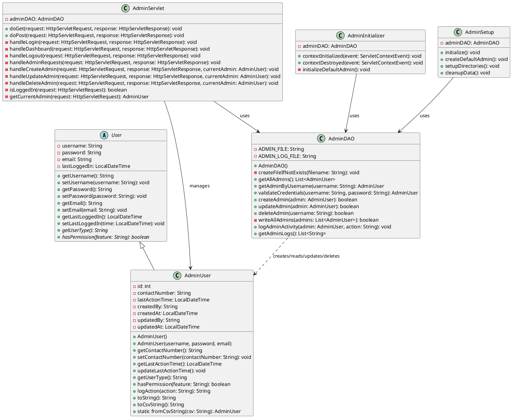

# Hotel Reservation System Admin Module - Class Diagram (Simplified)

This class diagram represents the simplified structure of the Hotel Reservation System Admin Module, showing the key classes and their relationships after removing role-based admin types.

## Diagram Overview

The system is built with these main components:

1. **Model Layer**
   - `User` (Abstract): Base class for all user types
   - `AdminUser`: Core admin user class with full permissions

2. **Data Access Layer**
   - `AdminDAO`: Handles all data operations with text files

3. **Controller Layer**
   - `AdminServlet`: Main controller for handling all admin-related HTTP requests

4. **Utility Layer**
   - `AdminInitializer`: Sets up initial data on application startup
   - `AdminSetup`: Handles system setup operations

## Key Relationships

- `AdminUser` inherits from the abstract `User` class
- `AdminServlet` uses `AdminDAO` to perform data operations
- `AdminServlet` manages `AdminUser` objects
- `AdminDAO` creates, reads, updates, and deletes `AdminUser` objects
- Utility classes use `AdminDAO` for system setup and initialization

## PlantUML Code

To visualize this diagram, copy the following PlantUML code to a PlantUML editor:

## Design Patterns Used

1. **MVC Pattern**: Separation of Models, Views (JSP files), and Controllers (Servlets)
2. **DAO Pattern**: Data Access Object for separating data access logic
3. **Singleton Pattern**: For the AdminDAO class instance
4. **Template Method**: Abstract methods in the User class implemented by subclasses

## System Responsibilities

- **User Authentication**: Login, logout, session management
- **Admin Management**: CRUD operations for admin users
- **Activity Logging**: Tracking admin actions
- **System Configuration**: Setup and initialization 